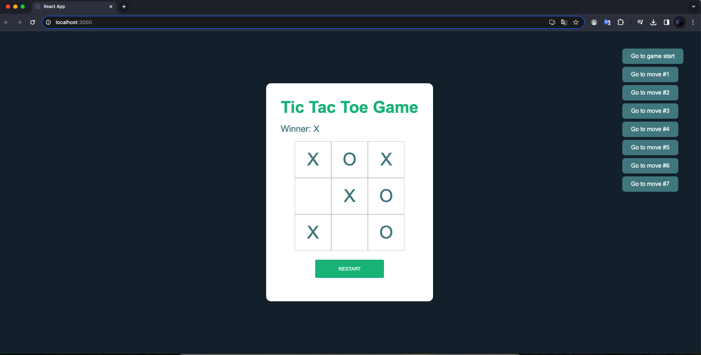

# Tic Tac Toe Game con React.js

Este proyecto proyecto fue hecho siguiendo la documentación de React JS para el entendimiento de conceptos dentro de react como useState() y componentes.

# Captura de pantalla



## Características

- Juego con completa funcionalidad.
- Desarrollado con React.js para seguir practicando y mejorar las habilidades.
- Verificar un ganador.
- Verificar cual es el turno actual.
- Verificar cuando es un empate.

## Instalación

1. Clona este repositorio:

    ```bash
    git clone https://github.com/ramiromtz/Tic-Tac-Toe-Game.git
    ```

2. Accede al directorio del proyecto:

    ```bash
    cd tic-tac-toe-react-tutorial
    ```

3. Instala las dependencias:

    ```bash
    npm install
    ```

4. Inicia la aplicación:

    ```bash
    npm start
    ```

La aplicación estará disponible en [http://localhost:3000](http://localhost:3000) en tu navegador.

## Uso

1. Abre la aplicación en tu navegador.
2. Simplemente comienza a jugar.

## Contribución

Si quieres contribuir a este proyecto, sigue estos pasos:

1. Haz un fork del proyecto.
2. Crea una nueva rama: `git checkout -b feature/nueva-funcionalidad`.
3. Realiza tus cambios y haz commit: `git commit -m 'Añadir nueva funcionalidad'`.
4. Haz push a la rama: `git push origin feature/nueva-funcionalidad`.
5. Abre un Pull Request.

## Contacto

- Autor: Ramiro Martínez Juárez
- Email: ramiromtz770@gmail.com
- GitHub: [ramiromtz](https://github.com/ramiromtz)
 
## Nota sobre el idioma del código

Este proyecto está escrito en inglés para seguir las mejores prácticas de la comunidad de desarrollo de software y facilitar la colaboración global. Aunque la documentación está en español para mayor accesibilidad, el código fuente utiliza convenciones en inglés.

Si tienes alguna pregunta o problema, no dudes en contactarme.
